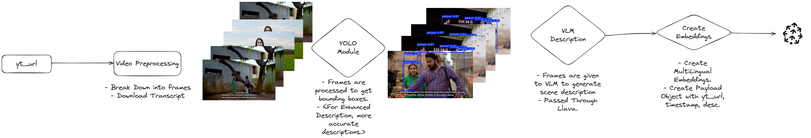

# Video-RAG
My implementation of Video-RAG

## Introduction: 

VideoRAG (Retrieval-Augmented Generation for Video) is an advanced AI technique that enhances video-based information retrieval and understanding. It combines retrieval-augmented generation (RAG) with video processing capabilities, allowing AI models to generate accurate, context-aware responses based on video content.

## Demo

[Link](https://www.veed.io/view/e9737cbe-7078-4cf4-9155-fd2cbb78551d?panel=share)


## Implementation:

- Video is converted to frames
- Frames are passed through YoLoV11 for Object Detection.
    - Frames are broken down in the format `<video_id>_frame_<timestamp>.jpg`
    - Transcript is downloaded in WebVTT format `<video_id>_captions.txt`
- Frames (with Bounding Boxes) are then passed to the VLM for enhanced visual  description, accurate descriptions.
    - Frames are saved in `result_<video_id>_<timestamp>.jpg`
- Visual Descriptions go through `nomic-embed-text-v2-moe`(local) and `snowflake-arctic-embed2`(hosted) (multilingual embedding) for efficient search across languages, we can query in hindi and english both to get the results.
    - Payload is made with description embedding, metadata with `yt_url`, `timestamp`: yt url with timestamp to directly play the video from that segment, `desc`: The description.
    - Payload is sent to Pinecone.

## High Level Architecture Diagram



## How to Setup

Step 1 : Setup python environment. (Preferred 3.11+)

```bash
uv venv /app/video_rag
source /app/video_rag/bin/activate
```

Step 2: Install the dependencies

```bash
pip install -r requirements.txt
```

Step 3: Run the script

```bash
python main.py
```

## Contact Me
In case of any issues please reach out me at `b22ai063@iitj.ac.in` or raise a Github Issue.